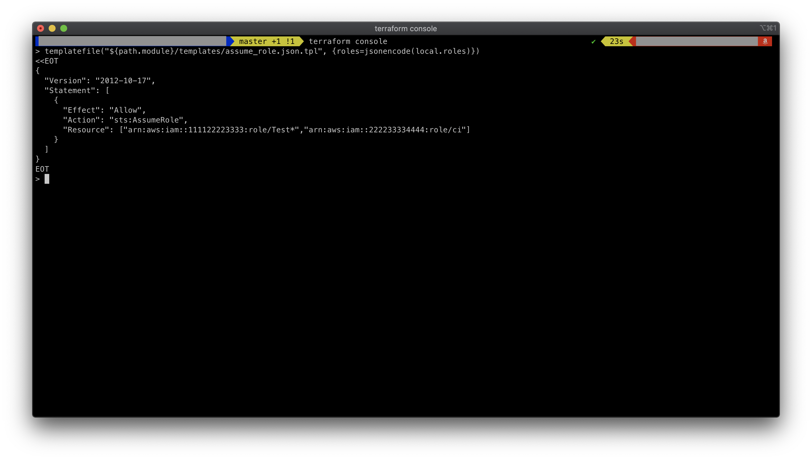

# Example demonstrating using template in IAM policy

## Use jsonencode
Use `jsonencode` to encode a given value to a string using JSON syntax

Example:
```terraform
locals {
  users = [
    "arn:aws:iam::111122223333:user/userA",
    "arn:aws:iam::222233334444:user/userB",
  ]
}

templatefile("example.json.tpl", {
        jsonencode(local.users)
}
```

## Debug using `terraform console`

Run `terraform console` in the project folder

```
> templatefile("${path.module}/templates/assume_role.json.tpl", {roles=jsonencode(local.roles)})
```


